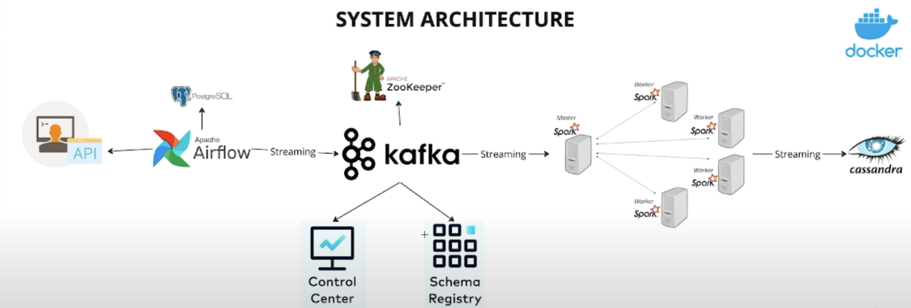
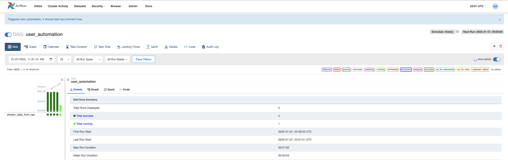
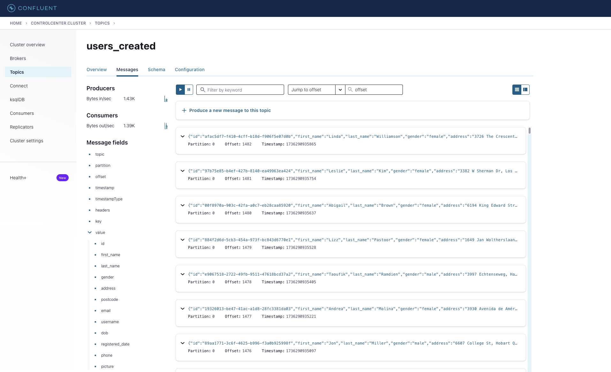
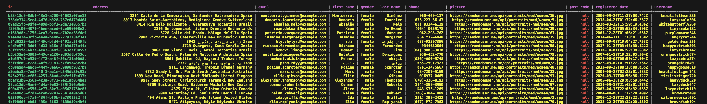

# Real time data pipeline

This project aims to provide a demonstration of the result of combining Apache Airflow, Apache Kafka, Apache Spark, and Apache Cassandra to set up a pipeline that is able to stream new data into a database. All tools are run within docker containers.

---

### System Architecture:

To begin with, airflow provides a schedule on which a Directed Acyclic Graph triggers a call to our existing api. The api provides us with information about our user base which then gets uploaded to a kafka topic. As this kafka topic receives messages, a spark cluster picks up each message and determines the proper course of action. In this case, to ingest it into a Cassandra keyspace.

---

### Airflow DAG:

Here you can see several successful runs of the Airflow DAG.

---

### Kafka broker:

Here you can see a glimpse of the kafka broker receiving new messages on our new users' topic.

---

### Cassandra:

Here you can see the newly ingested data within our table in Cassandra.

